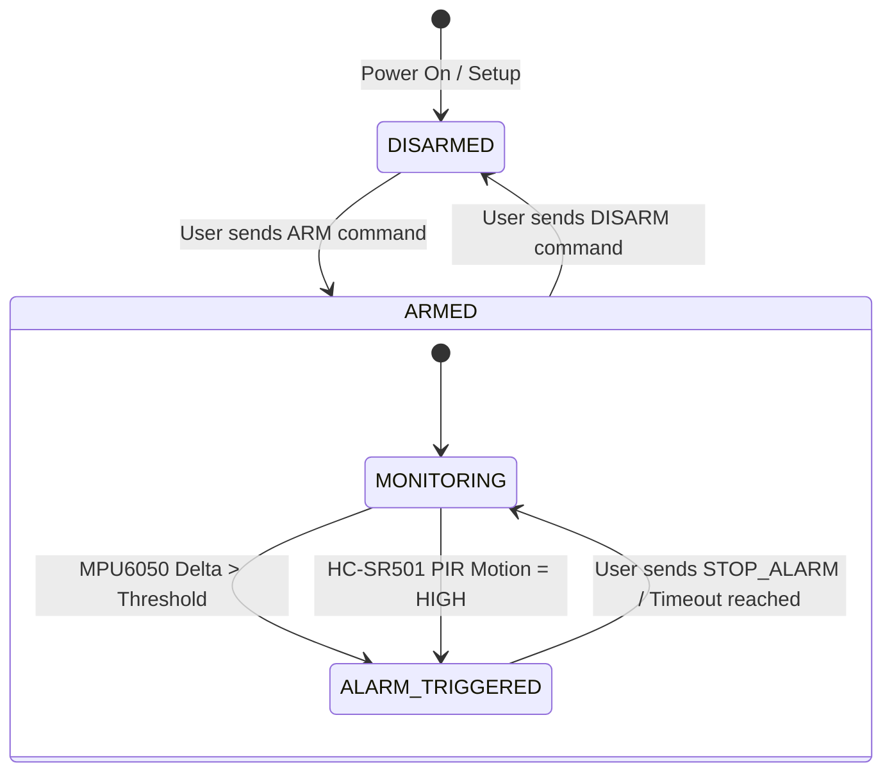

# SECUREBELONG: System Architecture & Data Flow

## 1. High-Level Architectural Diagram

```mermaid
graph TD
    subgraph Edge_Hardware ["Edge Hardware (ESP32)"]
        ESP32["ESP32 DevKit V1 (ESP-WROOM-32)"]
        MPU["MPU6050 6-DOF IMU (I2C: 21/22)"]
        PIR["HC-SR501 PIR Sensor (GPIO 13)"]
        GPS["NEO-6M GPS Receiver (UART2: 16/17)"]
        BUZZ["5V Active Buzzer (GPIO 23)"]
        
        MPU -->|I2C Telemetry| ESP32
        PIR -->|Digital Pulse Interrupt| ESP32
        GPS -->|NMEA 9600 Baud Data| ESP32
        ESP32 -->|Active High Signal| BUZZ
    end

    subgraph IoT_Gateway ["IoT Gateway & Server Layer"]
        Broker["Embedded Aedes MQTT Broker (:1883)"]
        API["Express + TypeScript REST API (:5001)"]
        WS["Socket.io Real-Time WebSocket"]
        DB[(SQLite Persistent Storage)]
        
        ESP32 <-->|MQTT Pub/Sub (Wi-Fi)| Broker
        Broker <--> API
        API <--> DB
        API <--> WS
    end

    subgraph Client_App ["SECUREBELONG Mobile Application"]
        UI_Dash["Dashboard (Arm/Disarm & State)"]
        UI_Sensors["Live Sensor Monitoring"]
        UI_Map["Live GPS OpenStreetMap (Leaflet)"]
        UI_Alerts["Alert Notification System"]
        UI_History["Audit Event History"]
        
        WS <-->|WebSocket Stream| UI_Dash
        WS <-->|WebSocket Stream| UI_Sensors
        WS <-->|WebSocket Stream| UI_Map
        API <-->|REST Ingestion| UI_Alerts
        API <-->|REST Ingestion| UI_History
    end
```

---

## 2. MQTT Topic Topology

All communication is structured under the `iot/security/{deviceId}/` namespace:

| Topic | Direction | QoS | Description |
|---|---|---|---|
| `iot/security/{deviceId}/telemetry` | ESP32 → Server | 0 | 1 Hz streaming JSON payload with all sensor values |
| `iot/security/{deviceId}/alerts` | ESP32 → Server | 1 (Retained) | Instant event publish when motion or intrusion occurs |
| `iot/security/{deviceId}/status` | ESP32 → Server | 1 (Retained) | Device online/offline state & IP address (includes LWT) |
| `iot/security/{deviceId}/heartbeat` | ESP32 → Server | 0 | 5s ping for watchdog disconnection detection |
| `iot/security/{deviceId}/command` | Server → ESP32 | 1 | Control directives (`ARM`, `DISARM`, `BUZZER_ON`, `BUZZER_OFF`, `SET_THRESHOLD`) |
| `iot/security/{deviceId}/ack` | ESP32 → Server | 1 | Command execution confirmation response |

---

## 3. Payload Schemas

### Telemetry (`iot/security/{deviceId}/telemetry`)
```json
{
  "device_id": "ESP32-SECURITY-001",
  "timestamp": 1724513520000,
  "mpu": {
    "accel_x": 0.012,
    "accel_y": -0.008,
    "accel_z": 1.004,
    "gyro_x": 0.2,
    "gyro_y": -0.1,
    "gyro_z": 0.0,
    "magnitude": 0.015,
    "motion": false
  },
  "pir": {
    "motion": false,
    "raw": 0
  },
  "gps": {
    "lat": 28.613939,
    "lng": 77.209021,
    "valid": true,
    "sats": 8,
    "alt": 216.0,
    "speed": 0.0
  },
  "buzzer": false,
  "armed": true,
  "wifi_rssi": -55,
  "free_heap": 189400,
  "uptime_sec": 3600
}
```

### Alerts (`iot/security/{deviceId}/alerts`)
```json
{
  "device_id": "ESP32-SECURITY-001",
  "alert_type": "MOTION",
  "title": "🚨 Personal Belonging Moved",
  "description": "Movement detected on protected personal belonging (Magnitude: 0.85g)",
  "severity": "HIGH",
  "timestamp": 1724513520000,
  "lat": 28.613939,
  "lng": 77.209021
}
```

### Commands (`iot/security/{deviceId}/command`)
```json
{
  "command": "SET_THRESHOLD",
  "params": {
    "threshold": 0.25
  },
  "timestamp": 1724513520000,
  "sender": "WEB_APP"
}
```

---

## 4. State Transition Machine


